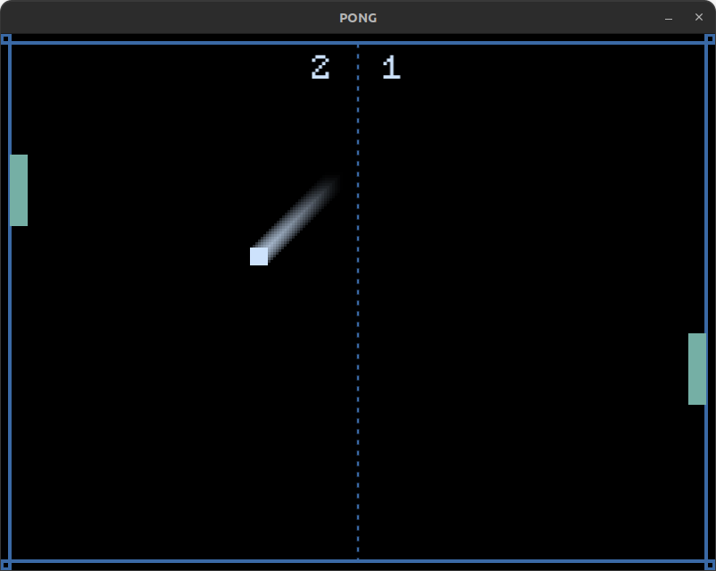

# Pong game

**Project type:** PC video game.  
**Brief description:** Pong has been made with LÖVE (also known as Love2D), a Lua framework. This is a cross-platform PC game (Windows, Mac and Linux) for two local players.  
**Technologies:** LÖVE (Lua).  

To launch it from the clone, [install LÖVE](https://love2d.org/#download) and then type ``love directory_name``.
