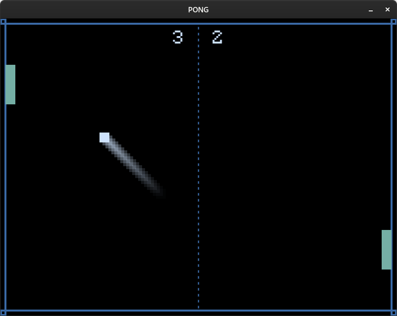

# Pong (LÖVE)

[Link to the download page (Itch.io)](https://lycorisdev.itch.io/pong)  

This *Pong* game is for two local players, on the same keyboard. It has been 
made with LÖVE, also known as Love2D, which is a simple Lua framework to make 
2D games pixel by pixel.  

This game is released with LÖVE version 11.5.  
